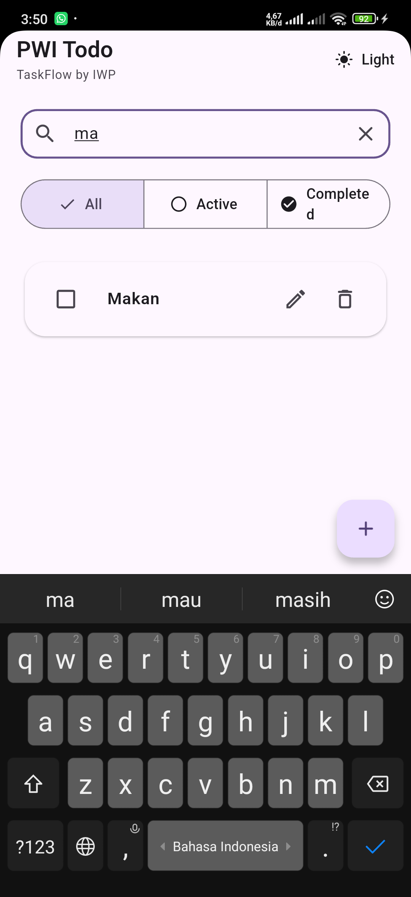
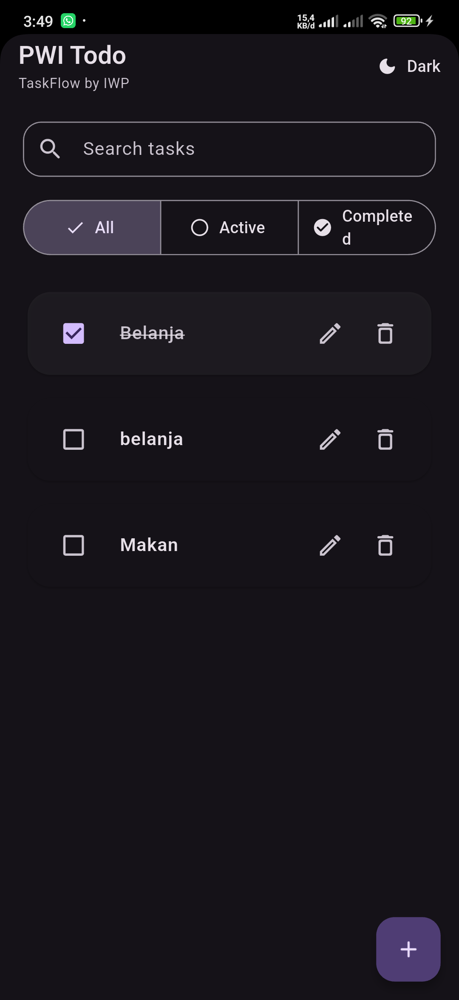
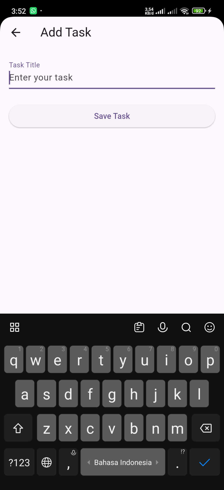
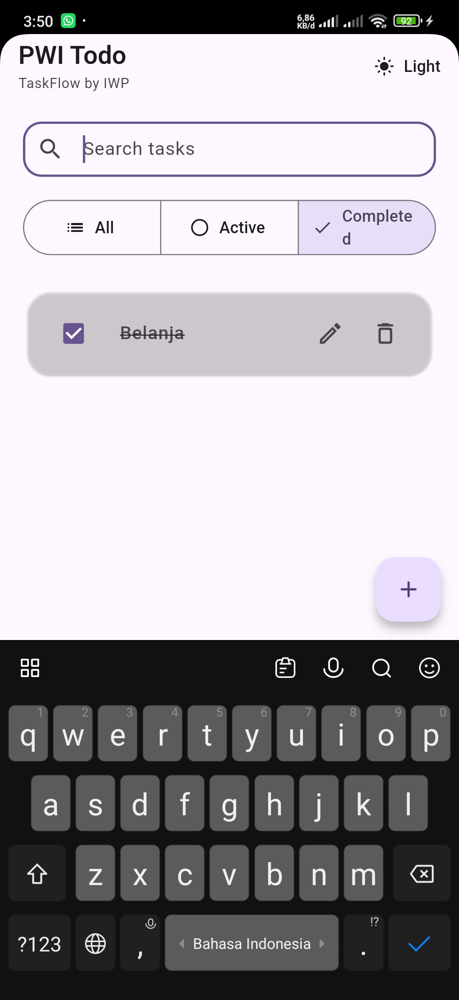

# PWI Todo

A modern task management application built with Flutter, featuring local storage, search & filtering, dark mode, and Material 3 design.

> **TaskFlow by IWP**


---

## 📖 About

PWI Todo is a portfolio project created to practice modern Flutter development using **Material 3**, **Riverpod**, **GoRouter**, and **Hive**. The project follows a structured development workflow, from planning and documentation to implementation, testing, and release.

---

## ✨ Features

- ✅ Create, edit, and delete tasks
- ✅ Mark tasks as completed
- ✅ Search tasks
- ✅ Filter tasks (All, Active, Completed)
- ✅ Dark & Light Mode
- ✅ Theme preference persistence
- ✅ Local storage using Hive
- ✅ Responsive Material 3 UI

---

## 📱 Screenshots

### Home (Light Mode)



### Home (Dark Mode)



### Add Task



### Completed Task



---

## 🛠 Tech Stack

| Technology | Purpose |
|------------|---------|
| Flutter | Cross-platform UI framework |
| Dart | Programming language |
| Material 3 | Modern UI design system |
| Riverpod | State management |
| GoRouter | Navigation & routing |
| Hive | Local data storage |

---

## 📂 Project Structure

```text
lib/
├── app/                 # App configuration
├── feature/             # Feature modules
│   └── home/
├── shared/              # Shared services, theme, utilities
└── main.dart
```

---

## 🚀 Getting Started

### Clone the repository

```bash
git clone https://github.com/iwp10/PWI_Todo.git
```

### Install dependencies

```bash
flutter pub get
```

### Run the application

```bash
flutter run
```

### Build Release APK

```bash
flutter build apk --release
```

The generated APK will be located at:

```text
build/app/outputs/flutter-apk/app-release.apk
```

---

## 🎯 Learning Objectives

This project was built to practice:

- Flutter project architecture
- State management with Riverpod
- Local database using Hive
- Navigation with GoRouter
- Material 3 UI
- Git & GitHub workflow
- Documentation-driven development

---

## 📌 Future Improvements

- 📅 Due dates
- 🚩 Task priority
- 📂 Categories
- 🔔 Notifications
- ☁️ Cloud synchronization
- 📊 Task statistics

---

## 📄 License

This project is created for **learning and portfolio purposes**.

---

<div align="center">

**Built with ❤️ using Flutter**

**TaskFlow by IWP**

</div>